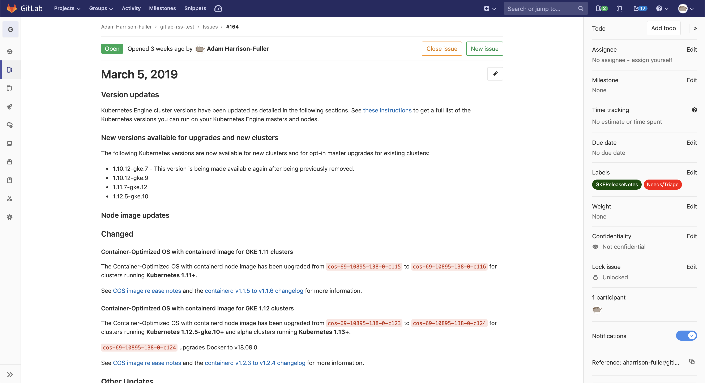
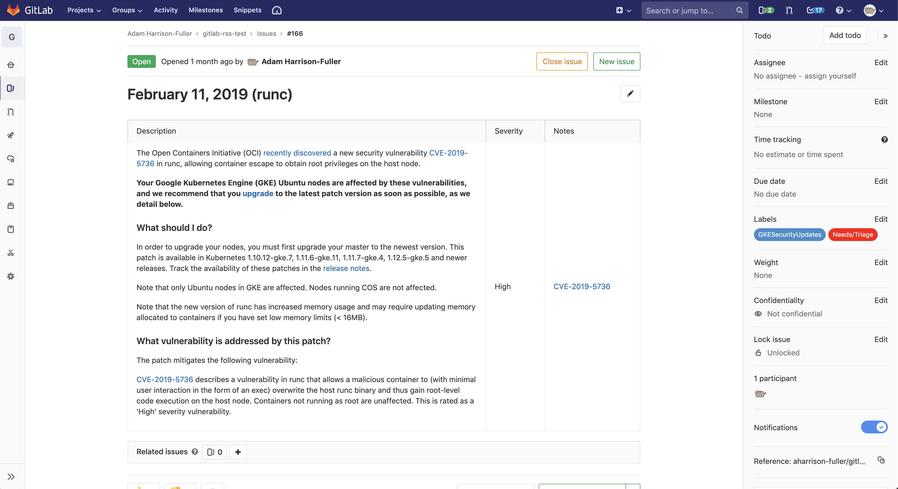

# Gitlab RSS Sync
Create Gitlab issues from RSS Feeds with optional labelling.  Created to monitor RSS feeds and bring posts to
our attention (Security Releases, Product Updates etc)

## Config file

The config file **MUST** be named config.yaml, an example one is provided [here](config.yaml.example).  Below is a brief
 description of its contents.

```yaml
interval: 300 // Interval in seconds to check the RSS feeds.
feeds:
  - id: test //Specify a feed ID that is used internally for duplicate detection.
    feed_url: http://example.com/rss.xml // The Feed URL.
    name: Test Feed // A User friendly display name.
    gitlab_project_id: 12345 // The Gitlab project ID to create issues under.
    added_since: "2019-03-27T15:00:00Z" // (Optional) For longer RSS feeds specify a ISO 8601 DateTime to exclude items published/updated earlier than this
    labels: // (Optional) A list of labels to add to created Issues.
      - TestLabel
   - id: feed2
     ...
```

## Docker
A Docker image is made available on [DockerHub](https://hub.docker.com/r/adamhf/gitlabrsssync)

### Required Environment Variables
* GITLAB_API_TOKEN - Gitlab personal access token that will be used to create Issues NOTE: You must have access to create
issues in the projects you specify in the config file.
* CONFIG_DIR - The directory the application should look for config.yaml in.
* DATA_DIR - The directory the application should look for (or create) the state.db in.

### Volume mounts
Make sure the location of your DATA_DIR environment variable is set to a persistant volume / mount as the database
that is contained within it stores the state of which RSS items have already been synced.

### Run it
```sh
docker run -e GITLAB_API_TOKEN=<INSERT_TOKEN> -e DATA_DIR=/data -e CONFIG_DIR=/app -v <PATH_TO_DATA_DIR>:/data -v <PATH_TO_CONFIG_DIR>/config adamhf/rss-sync:latest
```

## Prometheus Metrics
Two metrics (above and beyond what are exposed by the Go Prometheus library) are exposed on :8080/metrics
* last_run_time - The time of the last feed checks, useful for creating alerts to check for successful runs.
* issues_created - The total number of issues created in Gitlab, useful to check for runaways.

## Example Issues
### GKE Release Notes
Feed URL: https://cloud.google.com/feeds/kubernetes-engine-release-notes.xml

### GKE Security Updates
Feed URL: https://cloud.google.com/feeds/kubernetes-engine-security-bulletins.xml



### TODO
* Make the retroactive setting of the Gitlab creation time optional.